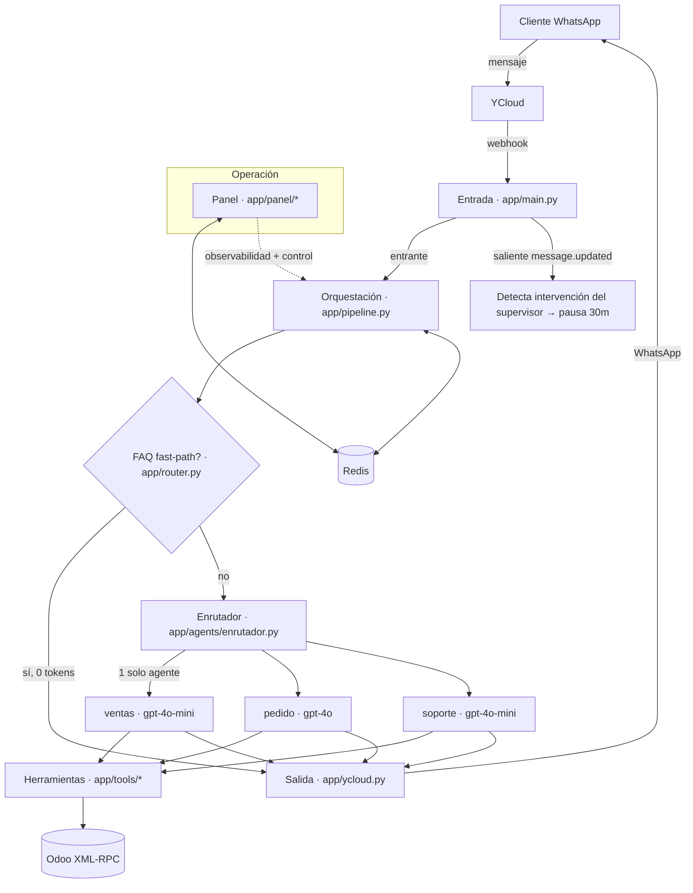

# Arquitectura — Pastoriza Bot

Bot de ventas de WhatsApp ("Michelle") para **Pastoriza Plastics SRL** (envases plásticos,
República Dominicana). Reemplaza un flujo previo en n8n por un servicio en código con
garantías verificables, observable y operable por personas no técnicas.

> Principio rector: **las garantías críticas viven en CÓDIGO, no en el prompt.** El LLM es
> un componente acotado; no puede ejecutar una acción que el código no le permita.

---

## 1. Vista general



**Stack:** FastAPI · openai-agents (OpenAI) · Redis · Odoo (XML-RPC) · YCloud (WhatsApp) ·
Telegram (alertas, opcional). Windows en dev; destino de producción: Dokploy.

---

## 2. Capas y responsabilidades

| Capa | Archivos | Responsabilidad |
|------|----------|-----------------|
| **Entrada** | `app/main.py`, `app/models.py` | Webhook YCloud (entrante, saliente `message.updated`, comandos `.on/.off`), parseo a `InboundMessage`, monta el panel. |
| **Orquestación** | `app/pipeline.py`, `app/debounce.py`, `app/repeticion.py` | Un turno completo: debounce de ráfagas → combinar media → anti-repetición → fast-path o agente → enviar → efectos. |
| **Cerebro** | `app/agents/*`, `app/tools/*` | Enrutador + 3 especialistas; herramientas de catálogo, cotización y Odoo. |
| **Integraciones** | `app/odoo.py`, `app/ycloud.py`, `app/media.py`, `app/catalogo.py` | ERP, envío WhatsApp, visión/transcripción, catálogo. |
| **Estado/Memoria** | `app/redis_client.py`, `app/session.py`, `app/estado.py` | Redis: sesión, pausa, ventana 24h, locks, ids del bot, cola de revisión. |
| **Operación/Mejora** | `app/panel/*`, `app/pagos.py`, `app/aprobacion.py` | Panel CRM en vivo, alertas, config, prompts por-agente, aprendizaje, kill-switch, aprobación del pago por el supervisor (ADR-013). |

---

## 3. Diseño multi-agente

Enrutado **determinista-first** → se invoca **un único** especialista por turno (nunca todos).

```
enrutador (0 tokens si es claro; gpt-4o-mini solo ante duda)
  ├── ventas   (gpt-4o-mini) · buscar_producto, detalle_producto, buscar_por_foto, link_tienda, cotizar, escalar_a_humano
  ├── pedido   (gpt-4o)      · detalle_producto, cotizar, verificar/crear/actualizar_contacto, crear_pedido, agregar_linea_pedido, buscar_pedidos_cliente, escalar_a_humano
  └── soporte  (gpt-4o-mini) · escalar_a_humano, buscar_pedidos_cliente
FAQ (envío, cuentas, dirección, horario) → app/router.py, 0 tokens, sin agente.
```

**Casos → agente dueño:** Pago/Comprobante→`pedido` · Foto→`ventas` · Cotización→`ventas` ·
Cancelación/Cambios→`soporte` (escala, no cancela).

**Prompt efectivo de un agente** = `prompts/base_comun.md` (identidad + seguridad + reglas
duras, compartido) + `prompts/{agente}.md` + conocimiento inyectado + datos de config +
bloques condicionales. Cada `.md` es editable/subible desde el panel (override en Redis).

---

## 4. Propiedad del dato

| Dónde | Qué | Duración |
|-------|-----|----------|
| **Odoo** | Clientes (`res.partner`), pedidos (`sale.order`/`.line`), catálogo (`product.*`), fichas de foto (`ir.config_parameter`) | Durable (fuente de verdad) |
| **Redis** (prefijo `pastoriza:`) | Conversación (`session:*`, 24h), pausa (`bot_disabled:*`, 30m), ventana 24h, debounce, locks, ids del bot (2h), cola de revisión, eventos/config/conocimiento del panel | Efímero |
| **Código / `.env`** | Secretos, reglas duras de negocio | Fijo |

`config` y `ads_map` usan keys literales (compartidas con n8n durante la migración).

Lo configurable existe en dos niveles: la key COMÚN y `…:c:<canal>` por número
(ver ADR-011). El sufijo lo arma `app/canales.py`.

---

## 5. Decisiones de arquitectura (ADR)

### ADR-001 · Migrar de n8n a servicio en código
**Contexto:** el flujo n8n dependía de prompts + regex frágiles para garantizar comportamiento.
**Decisión:** reescribir en FastAPI y mover las garantías a código.
**Consecuencias:** testeable, versionable, con garantías duras; mayor esfuerzo de dev inicial.

### ADR-002 · Efectos escritos por las tools, no por el modelo (anti-alucinación)
**Decisión:** `order_id`, `partner_id`, productos mostrados los escriben las herramientas en
`ConversationContext`; el modelo solo produce `RespuestaBot{mensaje, mostrar_productos, escalar}`.
**Consecuencias:** el bot **no puede** confirmar un pedido/pago inexistente ni enviar una foto
que una tool no devolvió este turno. Elimina toda una clase de alucinaciones.

### ADR-003 · Multi-agente con enrutador determinista-first
**Contexto:** un agente monolítico (12 tools, prompt gigante) alucinaba más y gastaba más tokens.
**Decisión:** enrutador + 3 especialistas por fase; enrutado por reglas/estado (0 tokens) y
clasificador `gpt-4o-mini` solo ante ambigüedad; FAQ determinista aparte.
**Consecuencias:** menos alucinación (prompt corto, pocas tools) y menos tokens. Trade-off:
un mensaje que cruza fases puede necesitar el turno siguiente para cerrar. Se rechazó dividir
por micro-caso (más enrutado/tokens, frágil ante mensajes multi-caso).

### ADR-004 · Modelo por agente (mini vs 4o)
**Decisión:** `gpt-4o-mini` para enrutador/ventas/soporte; `gpt-4o` solo para `pedido` (el
delicado). Configurable en `settings.model_mini` / `settings.model_agente`.
**Consecuencias:** menor costo/latencia sin sacrificar calidad donde el error cuesta.

### ADR-005 · Prompts por-agente en `.md` (archivos + panel)
**Decisión:** base versionada en `prompts/*.md`; override por agente en Redis, editable/subible
desde el panel con hot-reload.
**Consecuencias:** un no-técnico ajusta el comportamiento sin tocar código; auditable y
reversible. Las reglas duras compartidas viven una sola vez en `base_comun.md`.

### ADR-006 · Reglas duras de negocio en código
**Decisión:** precios corregidos contra catálogo en `agregar_linea_pedido`; **sin** herramienta
de cancelar/eliminar (solo añadir); dirección de envío detallada exigida en `crear_pedido`;
anti-jailbreak en `base_comun.md`.
**Consecuencias:** la manipulación no puede cambiar precios, cancelar ni despachar producto
equivocado, sin importar lo que "diga" el modelo.

### ADR-007 · Resiliencia de Redis según idempotencia
**Contexto:** Redis remoto (Redis Cloud) corta conexiones ociosas en turnos lentos.
**Decisión:** lecturas → `with_reconnect` (reintenta recreando pool); escrituras NO idempotentes
→ `run_write` (1 intento, sin reintentar, para no duplicar historial/eventos); lecturas dedupe
por id; el turno degrada en vez de caer ante un blip.
**Consecuencias:** sin duplicados; posible pérdida de una escritura puntual ante corte (aceptable).

### ADR-008 · Panel de operación + mejora continua supervisada
**Decisión:** panel único (observabilidad + control) con edición de config/prompts, kill-switch
global, y un ciclo donde el bot **propone** reglas y el humano **aprueba** (inyección inmediata).
**Consecuencias:** gobernanza clara (quién cambia qué, auditable, reversible); el modelo NO se
re-entrena solo. Fine-tuning queda diferido a cuando haya volumen.

### ADR-009 · Toma de control del supervisor vía `whatsapp.message.updated`
**Decisión:** el bot registra los ids que envía; si llega un saliente cuyo id no es suyo = lo
escribió un humano desde YCloud → pausa 30m ese chat. Fail-safe: ante duda, no pausa.
**Consecuencias:** el humano puede intervenir desde WhatsApp y el bot se aparta solo.

### ADR-013 · El bot no aprueba pagos: los aprueba el supervisor, desde WhatsApp
**Contexto:** regla del negocio, textual: *"el bot no puede recibir pagos, sólo puede hacer
cotizaciones; solo yo, el supervisor del 6701, apruebo"*. Antes el bot, al ver un comprobante,
le confirmaba al cliente que su pedido quedaba "registrado exitosamente" — o sea, daba por
buena una transferencia que nadie miró.
**Decisión:** el comprobante sigue creando el pedido y adjuntándose en Odoo (eso es trabajo
adelantado, no una confirmación), pero:

- La respuesta al cliente la fija el CÓDIGO, no el modelo: `_sanear` reemplaza lo que haya
  redactado por `cfg.msg_comprobante` ("estamos verificando tu pago"). El prompt también lo
  prohíbe, pero un prompt es una sugerencia; esto es determinista.
- El pago queda `pendiente` en el chatmeta (`events.guardar_aprobacion`).
- Al supervisor le llega una **plantilla de WhatsApp** (`aprobacion_pago`, ver
  `PLANTILLA_META.md`) con la **foto del comprobante** en la cabecera, el cliente con su
  dirección, los productos con cantidades y subtotal/ITBIS/envío/total, y dos botones.
- El número de pedido sale **sólo** de aprobar: por el botón (webhook) o por el panel. Rechazar
  NO le escribe nada al cliente a propósito — decirle a alguien que su pago no sirve lo hace
  una persona, con el motivo real.

La lógica vive en **un** lugar (`app/pagos.py`) porque la acción entra por dos puertas (botón y
panel), y la parte pura —montos, texto y parseo del botón— en `app/aprobacion.py`, que se testea
entera sin Redis ni HTTP. Sólo `ADMIN_PHONE` puede aprobar, comparando por los últimos 10
dígitos (el mismo número llega con y sin `+1`).
**Consecuencias:** el comprobante hay que **republicarlo** en nuestro dominio
(`app/media_publica.py` → `/panel/media/...`), porque las URLs de media de YCloud exigen
`X-API-Key` y Meta no puede descargarlas. Los topes de WhatsApp mandan en el diseño: las
variables van sin saltos de línea (los productos en una línea separada por `·`), el cuerpo entra
en 1024 caracteres y el payload del botón en 128. Si Meta todavía no aprobó la plantilla, el
envío falla y el sistema cae al aviso de siempre + cola de revisión: el pago queda pendiente en
el panel, que es la otra puerta. El supervisor también puede escribir `aprobar 160` a mano.

### ADR-012 · Semáforo de cierre: priorizar atención humana, nunca degradar el bot
**Contexto:** la operación pidió "filtrar los clientes que sí van a comprar de los que hacen
perder el tiempo". El costo de los dos errores es asimétrico: atender bien a quien no compra
cuesta centavos de tokens (el fast-path de FAQ cuesta 0); atender mal a quien sí iba a comprar
cuesta un pedido de 300+ unidades más su recompra. Y el error no es medible: si la etiqueta
cambia la atención, el marcado en frío compra menos y eso "confirma" la etiqueta.
**Decisión:** `app/score.py` calcula un **semáforo de cierre** por conversación, función PURA
sobre HECHOS que ya escriben el código y las tools (pidió las cuentas, dijo que pagó, mandó
comprobante, cotizó, monto sobre el mínimo, eligió entrega, dio dirección/ubicación, contacto y
pedido en Odoo). Hitos acumulativos, guardados en el chatmeta que el panel ya lee.
Restricciones, que son la decisión y no un detalle:

- **No cambia nada de cómo atiende el bot.** No se inyecta en ningún prompt: si el modelo no lo
  ve, no puede filtrárselo a un cliente.
- **No hay puntaje negativo ni etiqueta de "no compra".** Pedir la lista completa, preguntar por
  millar, regatear o no dar cantidad es la apertura del MAYORISTA.
- **Nunca mide cómo escribe el cliente** (ortografía, tildes, largo, audio vs texto, cantidad de
  preguntas): en RD es un proxy de clase y `prompts/base_comun.md` ya ordena lo contrario.
- **Gris = sin señales todavía**, distinto de "malo"; y `sem` vacío = sin datos.
- **Fail-open:** si algo falla, nadie queda marcado en frío (`score=None`).
- **Nunca en Odoo:** una probabilidad de compra en `res.partner` sería perfilado permanente,
  exportable y visible para todo el personal.

**Consecuencias:** el panel ordena a quién llamar primero (botón «↕ por cierre», con
«esperando respuesta» arriba) y muestra el semáforo SIEMPRE con su desglose en texto, para que
sea discutible. Costo: 0 tokens y 0 llamadas nuevas; en Redis queda en neto NEGATIVO, porque al
pasar `emisor` explícito a `publicar()` se ahorran más lecturas de las que agrega.

### ADR-011 · Dos canales (números de YCloud) con configuración independiente
**Contexto:** el negocio atiende con DOS números — uno de ellos COEXISTENTE con la app de
WhatsApp Business— y cada uno es una operación aparte: sus conversaciones, sus precios, sus
prompts, sus reglas aprendidas y sus agentes. Un solo despliegue debe servir a los dos.
**Decisión:** el **canal** es el número NUESTRO por el que entró el mensaje
(`emisor` = `msg.instance_from`, normalizado a sus últimos 10 dígitos por `app/canales.py`).
Cada dato configurable vive en dos niveles:

```
pastoriza:algo              -> COMÚN (la base que heredan los dos números)
pastoriza:algo:c:8092221092 -> PROPIO de ese canal (gana sobre el común)
```

Aplica a `config` (business_config), `panel:prompt:{agente}` (prompt_store),
`panel:reglas` / `panel:correcciones` (conocimiento) y `panel:agentes_custom`.
El canal viaja en `ConversationContext.emisor`, así que `armar_instrucciones` resuelve prompt +
conocimiento por canal en cada turno y **un mismo Agent sirve a los dos números**.
Guardar desde el panel toca sólo el canal abierto; `ambos=True` escribe el común y borra los
propios (es la única forma de afectar al otro número).
**Consecuencias:** cambiar de pestaña en el panel cambia TODO (conversaciones, config, prompts,
aprendizaje, logs y cola de revisión). `YCLOUD_FROM` debe quedar VACÍA con dos canales (si no,
todo saldría por un solo número): se avisa al arrancar por log y Telegram. Lo que sigue
compartido por chat_id —y no por canal— es la sesión/historial, la pausa de 30 min y el
debounce: si el MISMO cliente escribe a los dos números, comparten hilo.

### ADR-010 · Un worker por ahora (límite consciente)
**Contexto:** caches en memoria por-proceso (prompts, conocimiento, config, catálogo).
**Decisión:** correr en 1 worker hasta la fase de escalado.
**Consecuencias:** un cambio del panel se ve al instante en ese proceso. Para >1 worker se
requiere propagación (Redis pub/sub) — pendiente. Documentado, no descubierto después.

---

## 6. Seguridad

- **Anti-jailbreak/inyección:** el contenido del cliente (texto/imagen/audio/ubicación) nunca es
  instrucción; reglas en `base_comun.md`.
- **Precios/pagos:** fijos, corregidos en código; sin descuentos automáticos.
- **Anti-frustración/abuso:** repetición 3× → pasa a un asesor; insultos → escala.
- **Acceso:** webhook con `X-Webhook-Token`; panel con `X-Panel-Token`; allowlist de números
  para convivir con n8n durante la migración.

## 7. Observabilidad

Feed de eventos en Redis (turnos, pedidos, escalamientos, errores con traceback + "Copiar para
Claude"), alertas por tipo, notificación opcional a Telegram, y `/health`, `/health/deep`.

## 8. Calidad

**332 tests** de lógica pura y determinista (enrutado, matching, cotización, saneo de salida,
entrega, repetición, prompts, separación por canal), corren sin secretos ni red
(`tests/conftest.py` fija dummies; el panel se prueba con TestClient + `tests/fake_redis.py`).
Lo no-determinista (el modelo) queda acotado por las reglas duras.

## 9. Escalabilidad y pendientes

- **Escalado:** propagación de caches entre workers (Redis pub/sub) para >1 worker.
- **Deploy:** Dokploy con Redis co-ubicado (elimina la inestabilidad del Redis remoto) y validar
  Telegram fuera del firewall corporativo.
- **Validar:** payload real del webhook saliente de YCloud.
- **Diferido:** fine-tuning con ejemplos aprobados.
